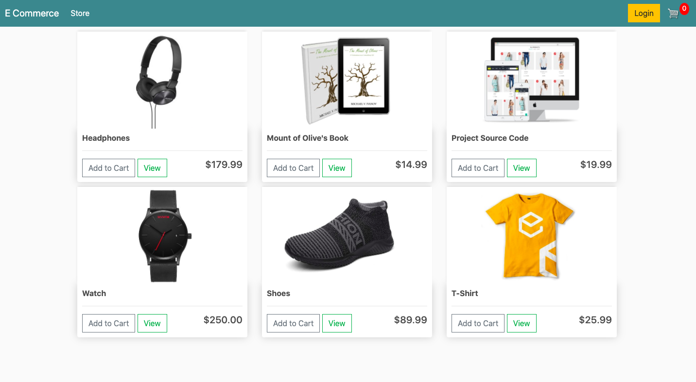
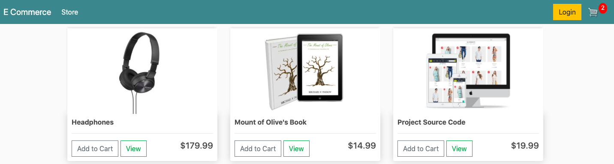
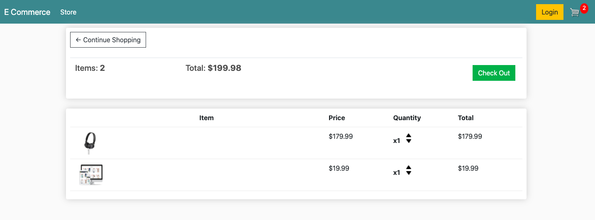
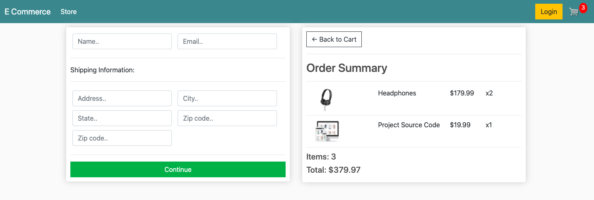
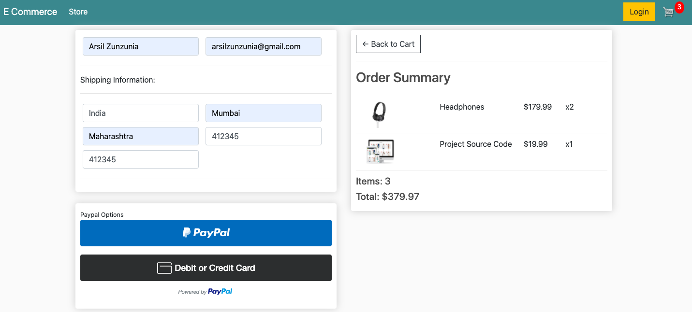
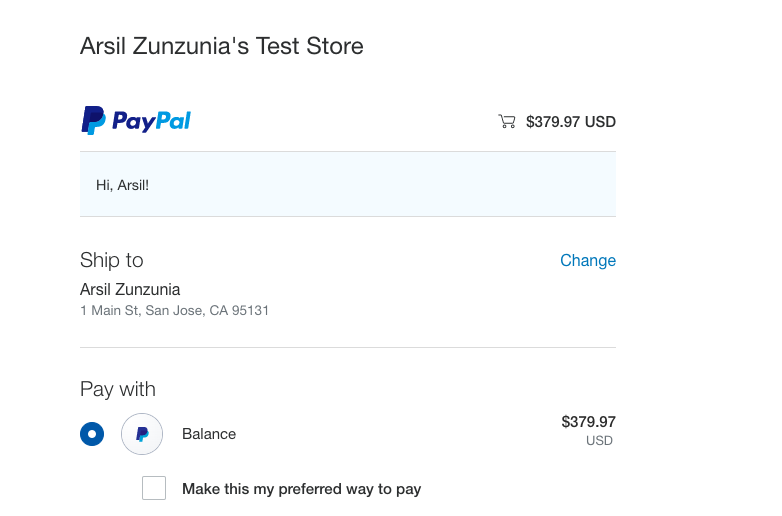
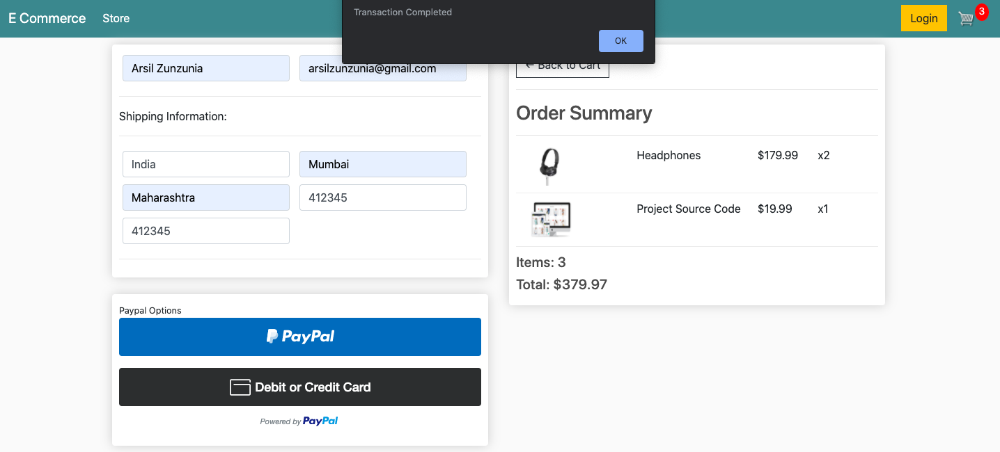

# E-commerce (Guest User Checkout System)

A Django based E-commerce system capable of Guest User Checkout with PayPal API.
## Getting Started

These instructions will get you a copy of the project up and running on your local machine for development and testing purposes.

### Prerequisites

Clone the repository and open in any code editior, open the terminal and create a fresh virtual environment by typing following command. Then activate it by the next command.

#### On Windows
```python
py -m venv env

.\env\Scripts\activate
```
#### On Mac
```python
python3 -m venv env

cd env

source env/bin/activate
```

### Installing

After successfully activating virtual environment
type the following command to install all requirements for starting the project.

```python
pip install -r requirements.txt
```

At this stage you have successfully done with the installation of project, it is ready to run now. Just run two commands to configure the database.

```python
python manage.py makemigrations

python manage.py migrate
```
This will successfully create tables in the database and you can check those tables in you database.
 To run the project type:
 ```python
python manage.py runserver

# then visit below url in your browser:
http://127.0.0.1:8000/
```
And guess what you have successfully configured this system to run on you machine.

## Screenshots of Pages

### Home:
Below is the home page where registered or guest users can see products.



### Products added in cart:
Selected products are added in cart and count is reflected on upper right hand side on the cart icon.



### Cart:
Cart Page reflecting products added in cart, allowing quantity change for products.



### Checkout:





### Paypal:

Using Developer Paypal API to integrate paypal option for this ecommerce store, where money is debited from one sandbox account and credited to the store's sandbox account.




